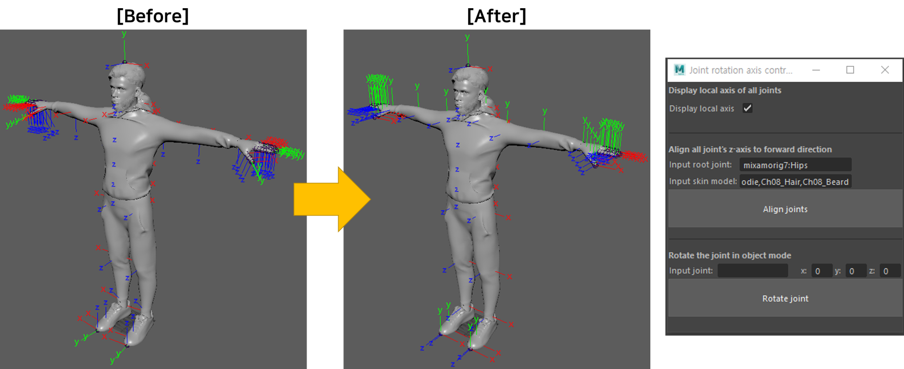
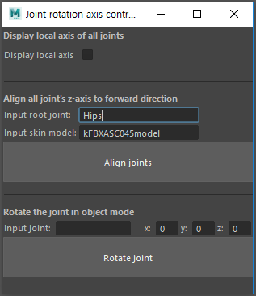

# Joint re-orientation on skinned mesh
This Maya script sets the orientation of each joint to be identity while preserving the hierarchy and skinning info.   
We used the script to modify the orientation value of the joint to identify in the binding pose.   
The code is tested in Maya 2018 and 2019   

> ### To run script
> 1. Click the Script Editor button in the bottom right of the main Maya window and open "alignJointAxisZForward.py"
> 2. Press Ctrl + Enter to execute the script
> 3. GUI appears!

> ### How to use
> 
> * #### Display local axis of joints
>   * If checkbox is checked, all local joint axes are displayed.
> * #### Aligning the z-axis of all joints
>   * <b>Input root joint</b>: the root joint of the target skeleton   
>     ※ You can drag and drop the joint object into the text field, but you should delete the path in the case of joint object.  
>     e.g.) |Hips (X) → Hips (O)
>   * <b>Input skin model</b>: meshes skinned to the target skeleton   
>     ※ You can drag and drop the skin model.   
>     ※ If there are multiple skin models, you can put all models by separating with ',' (no blank)   
>     e.g.) Body, Hair, Clothes (X) → Body,Hair,Clothes (O)
>   * Click the "<b>Align joints</b>" button to align the z-axis of all joints.
> * #### Rotating the joint in object mode
>   * <b>Input joint</b>: the joint that you want to rotate   
>     ※ You can drag and drop the joint object even if there is a path in the name.   
>     e.g.) |Hips|Spine (O)
>   * <b>x, y, z rotation values</b>: how much you want to rotate the joint
>   * Click the "<b>Rotate joint</b>" button, then the selected joint only rotates according to values of rotation without modifying other things.
